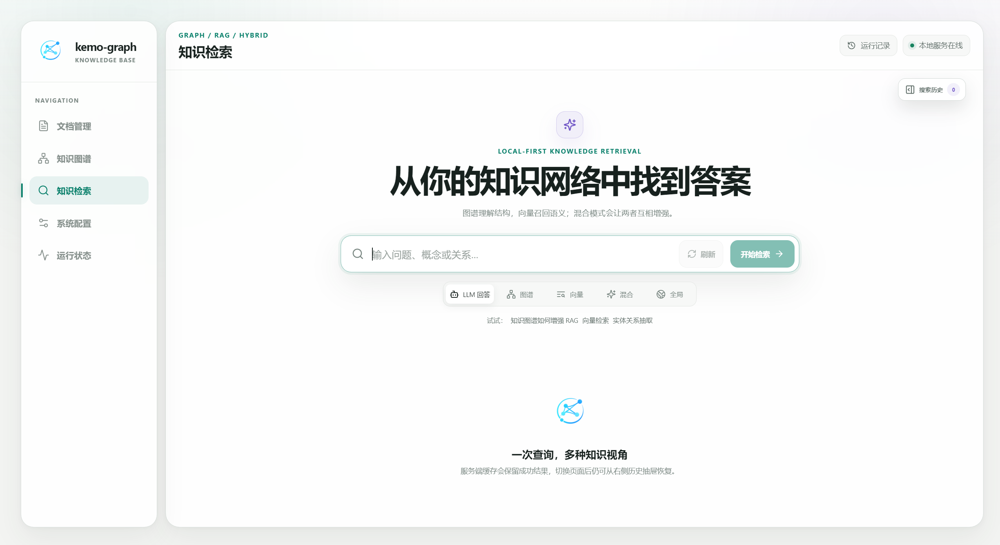

# kemo-graph

<p align="center">
  
</p>

<p align="center">
  <strong>简体中文</strong> · <a href="README.en.md">English</a>
</p>

<p align="center">
  <strong>面向 Kemo 生态的本地图谱与检索基础设施。</strong>
</p>

<p align="center">
  将多格式资料沉淀为可追溯的知识图谱与向量索引，<br>
  让智能体不仅能找到原文，也能理解概念、关系、来源与上下文。
</p>

<p align="center">
  <a href="version.json"></a>
  <a href="https://github.com/kesepain-KE/kemo-graph"></a>
  <a href="LICENSE"></a>
  <a href="api.md"></a>
</p>

---

## 如果智能体不必每次都从文件堆里猜答案

一个长期使用的智能体，终究会遇到同样的问题。

资料越来越多：项目文档、课程笔记、方案草稿、网页导出、PDF、Word、表格与零散记录都被妥善保存下来。可当智能体真正需要回答一个问题时，它往往只能临时检索几段相似文字，再从中推测上下文。

它或许找得到“出现过什么”，却不一定知道：这个概念和哪些概念有关；一条关系由哪些资料共同支持；某段检索结果来自哪份原文；文件更新或删除后，哪些知识仍然可信。

**kemo-graph 想成为 Kemo 生态中专门处理这件事的一层基础设施。**

它把原始资料、转换后的 Markdown、图谱节点、关系证据与文本向量连在同一条可维护的链路上。于是，智能体不只是在文件里“搜索答案”，而是可以沿着知识结构找到关系，再回到原文确认依据。

它不是另一位负责聊天的智能体，而是让智能体能够长期使用资料、理解资料并持续维护资料的知识层。

---

## 它能做什么

| 场景 | 能力 |
|---|---|
| 项目知识沉淀 | 把设计文档、笔记、决策记录逐步连接为可查询的概念网络 |
| 智能体知识协作 | 让 kemo-agent 在需要时通过 API 取得图谱关系与原文证据 |
| 多格式资料整理 | 本地 PDF、Word、PowerPoint、Excel、邮件、文本、表格与结构化数据统一转为 Markdown |
| 来源追溯 | 从图谱或检索命中回到对应原文，避免只有结论没有依据 |
| 多路检索 | 图谱、向量、混合、问答与全局主题五种方式，适合不同问题 |
| 可调抽取与稳健召回 | 图谱抽取支持细/标准/粗颗粒度；检索结合查询扩展、FAISS 多路融合与精确词面兜底，兼顾语义与短词命中 |
| 增量维护 | 文件变化后只更新受影响的数据，而不是反复重建整个知识库 |
| 项目化文档管理 | 按项目归类上传，支持 Markdown 预览与编辑、重命名、单篇或批量移动 |
| 过程可见 | 独立构建状态页、真实检索步骤进度，以及终端／查询／内部运行日志 |
| 低开销读取 | 通过有界内存缓存复用未变化的状态、日志与知识库指纹，减轻重复磁盘读取 |
| 安全删除 | 删除文档或节点时检查共享来源，尽量避免误伤其他资料支撑的知识 |
| 独立部署 | 提供本地 Web、CLI 与 HTTP API，也可接入更大的 Kemo 智能体系统 |

---

## 快速开始

### 环境要求

- Python 3.10+
- Node.js 18+（构建网页前端时需要）
- Git
- 可访问的 Kemo 网关（kemo-adapter-api），并已注册可用的 LLM、Embedding 与 Rerank 模型

### 获取并启动

以下为 Windows PowerShell 示例：

```powershell
git clone https://github.com/kesepain-KE/kemo-graph.git
cd kemo-graph

python -m venv .venv
.\.venv\Scripts\Activate.ps1
pip install -r requirements.txt

Copy-Item .env.example .env
```

在 `.env` 中至少配置网关调用密钥：

```dotenv
KEMO_API_KEY=你的-kemo-网关调用密钥
```

图谱抽取默认采用 `large` 粗粒度，可在网页“系统配置”或 `config/config.json` 中调整为 `small`（细）、`medium`（标准）或 `large`（粗）；同时可用 `graph_extract_chunk_size` 调整基准分段大小。粗粒度会限制每段实体和关系预算，细节优先写入节点摘要，避免图谱膨胀。检索会自动保留原始问题，并在安全范围内扩展同义词、批量召回，再用精确词面通道补救中文短词和标识符命中。

修改图谱档位后，下一次扫描会自动将已完成文档标记为 Graph 待重建；可运行 `python start.py rebuild-knowledge-base` 重新整理，而无需因此重建未变化的 RAG 向量。

在 `config/config.json` 中确认网关地址与所需模型，然后构建网页前端并启动：

```powershell
cd web\frontend
npm install
npm run build
cd ..\..

python start_web.py
```

默认访问 `http://127.0.0.1:8000`。

Linux/macOS 终端可使用同一启动入口：

```bash
git clone https://github.com/kesepain-KE/kemo-graph.git
cd kemo-graph
python3 -m venv .venv
source .venv/bin/activate
python -m pip install -r requirements.txt
cp .env.example .env
# 编辑 .env 与 config/config.json，配置网关和模型
cd web/frontend
npm ci
npm run build
cd ../..
python start_web.py
```

---

## 基本使用

### 网页

启动后即可在浏览器中：按项目上传与管理资料、预览和编辑 Markdown、查看独立构建状态、浏览知识图谱、使用五种检索模式、管理回收站，并追踪后台任务、检索步骤与运行日志。

<p align="center">
  
</p>

<p align="center">
  <sub>本地优先的知识检索工作台：统一使用图谱、向量、混合检索与 LLM 回答。</sub>
</p>

#### 项目文件夹与文档管理

文档管理页支持创建项目文件夹、按项目查看资料，以及在“导入到”中选择上传位置。原有根目录文档显示在“未分组”；项目对应当前知识库规范 Markdown 目录下的真实一级文件夹，**不是独立知识库或检索隔离区**。

- 在文档详情工具栏使用“重命名”“移动”；勾选多篇文档后可“批量移动”。
- 改名和移动保留文档 `source_id`、正文哈希及已有 Graph/RAG 索引，不触发模型调用；正文编辑后仍由用户手动重建。
- 同步更新 `file_map.json` 和来源路径，旧路径的搜索缓存不再复用；同名目标、来源映射冲突会拒绝操作，不覆盖其他活动文档。
- 项目视图中的“清空本项目”仅删除该项目文档；“全部文档”视图中的“全库删除”仍作用于当前知识库全部项目。
- 有后台任务时请等待完成再改名或移动；外部智能体同步的资料仍应在上游系统中管理名称与位置。

#### 检索进度

知识检索以短标签显示本次实际执行的步骤，包括 LLM 优化、关键词与问题拆分、查询向量化、图谱／向量／关键词召回、切片聚合、重排序及回答生成。未执行的步骤不显示为完成；缓存命中和规划回退有独立标记。切换站内页面不会中断检索，刷新或关闭网页不保留等待状态。

文档切片与文档向量化发生在建库阶段；检索阶段处理的是问题与已有切片，不会为了展示进度而重新切分、重建文档。实时步骤使用进程内短期状态，不新增模型调用或磁盘进度日志；多进程部署需将查询与进度轮询路由到同一工作进程，否则只显示该进程可确认的步骤。

#### 构建状态

文档管理的文件名搜索位于文档列表标题下方、项目文件夹上方。Graph / RAG 状态筛选集中到侧边栏的“构建状态”页：可查看两条构建链路的待处理、处理中、就绪和失败数量，组合文件名与状态筛选，每页最多显示 6 篇文档，列表内部滚动。支持手动刷新或每 5 秒自动刷新；离开页面停止轮询，不中断后台构建任务。上传、编辑和手动批量重建入口仍在文档管理中。

#### 运行状态与日志

“运行状态”页提供独立的运行日志卡片，可切换**终端启动日志、查询日志、内部运行日志**，按 UTC 日期查看；支持手动刷新、每 5 秒自动刷新与跟随最新记录。日志在卡片内部滚动，不撑长整页。

终端标签展示启用记录后的 Web 启停及 Python/Uvicorn 日志，不回补历史 shell 输出，也不捕获未接入 logging 的第三方直接输出。查询日志包含开始、完成、失败、耗时、缓存和召回事件，使用 `query_id` 关联查询生命周期，不额外记录问题正文或模型回答。默认显示最近 200 条，单次只扫描当天日志文件末尾 2 MB；密钥、Bearer、Token 等敏感内容会脱敏。升级后需重启服务才能开始记录新增终端日志。

#### 内存读取缓存

长驻 Web/API 进程共享一层有界内存读取缓存，用于知识库指纹、文档分页、运行状态（含 FAISS 健康检查结果）、日志、配置正文和查询规划提示词摘要，减少未变化数据的反复读取。它不替代原有 SQLite 搜索结果缓存，也不会改变强制查询、清理搜索历史或数据库写入的行为。

- 全进程最多 256 项、32 MiB 的序列化缓存数据，单项最多 2 MiB；这是缓存载荷限制，不是整个进程的内存限制。超限按最近使用情况淘汰，大项直接读取而不保留。
- 每次读取先检查文件身份、大小和修改信息；SQLite 额外检查 100 字节文件头。正常提交、改名、删除及数据库替换会使对应读取失效；未变化条目也最多复用 30 秒。
- 非空 WAL 或事务日志存在时保守绕过数据库读取缓存，避免只看主数据库而漏掉尚未回写的变化。不持有长期数据库连接，兼容项目重建替换文件。
- 相同数据的并发读取合并执行，返回内容相互隔离；失败结果不进入缓存。日志缓存同时区分当前脱敏密钥，密钥变化后重新脱敏。
- 缓存按绝对 Store 路径隔离，重启后为空；多个服务进程各有自己的内存缓存，CLI 单次进程仅在本次调用期间受益。数据库与日志仍正常落盘，不使用延迟写入。

#### 知识文档预览与渲染

网页端预览的是导入后实际进入 Graph/RAG 的规范 Markdown，而不是直接把 PDF、Office 或其他二进制文件交给浏览器。预览使用 `react-markdown`、GFM、KaTeX 和按需加载的 Mermaid 渲染器，支持：

- 标题、粗体、斜体、删除线、嵌套列表、任务列表、引用块、水平分隔线、表格、脚注、链接、图片和代码块；
- 行内数学公式 `$a^2+b^2=c^2$` 与行间公式 `$$...$$`；
- 常见 LaTeX 外层分隔符 `\(...\)`、`\[...\]`，以及 `aligned`、`cases`、矩阵、分数、积分、求和、极限、中文 `\text{}` 和 `\xrightarrow{}`；
- 代码语言高亮；
- Mermaid fenced block，例如：

  ````markdown
  ```mermaid
  flowchart TD
      A[原始资料] --> B[Markdown]
      B --> C[知识图谱]
      B --> D[RAG 向量]
  ```
  ````

- Obsidian 风格双链：`[[数据结构]]`、`[[数据结构|查看结构]]`；
- Obsidian 风格 Callout：

  ```markdown
  > [!NOTE] 说明
  > 这是会被渲染成主题化信息卡片的正文。
  ```

- `![[文档或图片]]` 嵌入语法的安全占位显示；
- YAML/TOML frontmatter 识别，并从正文阅读区隐藏。

公式渲染采用 KaTeX。复杂公式不会撑破预览气泡，超宽矩阵和长公式会在文档内部横向滚动。Mermaid 只在文档实际出现图表时动态加载，普通文档不会承担图表引擎的初始化开销。

为避免导入文档成为脚本注入入口，预览默认不执行原始 HTML 和 `<script>`；网页、视频、音频、OCR、远程链接等内容仍应由上游智能体先处理成 Markdown 或本地文件。KaTeX 不支持的自定义宏会保留原始公式并显示局部错误提示，不会导致整篇文档白屏。

### 命令行

```powershell
# 只转换为 Markdown，不初始化知识库，也不调用模型
python -m markitdown $env:KEMO_GRAPH_IMPORT_FILE -o output.md
python convert.py $env:KEMO_GRAPH_IMPORT_FILE -o output.md

# 导入文件（先不消耗模型额度）
python start.py import $env:KEMO_GRAPH_IMPORT_FILE --no-ingest

# 扫描并整理所有待处理文档
python start.py ingest

# 查询
python start.py query-hybrid "知识图谱如何增强检索"
python start.py query-answer "请综合图谱和原文回答"

# 将 kemo-agent 等上游表记录同步到其独立 Store
python start.py --store-root $env:KEMO_GRAPH_STORE_ROOT source-sync records.json

# 状态与维护
python start.py status
python start.py list-docs
python start.py organize-graph
python start.py rebuild-all

# 检查并应用更新
python start.py update-check
python start.py update
python start.py update-changes

# 根目录更新入口：同版本时会询问是否强制重新执行更新
python update.py

# 更新前先看有哪些未提交的更改，或备份未提交修改后强制更新
python update.py --dirty
python update.py --force
```

文档归一化层只处理本地普通文件。网页抓取、视频、音频、OCR 与远程链接应由上游智能体先处理，再把 Markdown 或本地文件交给 kemo-graph；转换器不会访问网络。

### HTTP API

kemo-graph 可作为独立服务运行，向 kemo-agent 等智能体提供图谱查询、混合检索、导入与维护等端点：

```powershell
uvicorn api:app --host 127.0.0.1 --port 8000
```

完整请求字段、响应包络与错误码约定见 [api.md](api.md)。

---

## 数据与隐私

- 转换后的 Markdown、图谱与索引数据都保存在本地工作目录；Markdown 是事实来源，其余数据可随时重建。
- 图谱构建、Embedding 与 Rerank 会通过 Kemo 网关调用模型；处理敏感资料前，请确认网关、模型与网络边界。
- 应用查询生命周期日志不额外保存问题正文或模型回答，日志查看会脱敏已知密钥与常见认证字段；第三方 Python 日志仍可能包含业务信息，请保护日志和服务访问权限。

> **注意**：当前外部 API 没有内建应用层鉴权。默认应监听 `127.0.0.1`；若需跨设备或公网访问，请在外部部署 VPN、反向代理、TLS 或认证层，不要直接暴露未受保护的端口。

---

## 我们希望它成为什么

kemo-graph 不试图成为替代所有文件管理、所有数据库或所有搜索系统的项目。

它更希望成为 Kemo 生态中稳定的一层知识基础：资料进入系统后仍然保留来源与可追溯性；关系可以被发现，但不会脱离原文证据；文件发生变化时，系统知道该更新什么、保留什么；模型与 Provider 可以变化，但本地事实来源始终留在用户手中。

真正能陪伴长期项目的智能体，不应只拥有更长的上下文窗口，也应拥有一套能够持续理解资料、验证来源并维护结构的知识基础。

---

## 当前状态

核心闭环已经可以实际运行：统一导入、增量更新、图谱与向量检索、混合问答、安全删除、定时维护，以及本地 Web、CLI、HTTP API 三个入口和面向 kemo-agent 等智能体的外部知识服务接口。

当前版本为 **1.5.0**。本次更新聚焦更新入口的可用性：`python update.py --dirty`（或 `start.py update-changes`）可以在更新前查看未提交的工作区更改，并区分会阻塞更新的程序文件与不影响更新的用户配置；`python update.py --force` 会在更新前把未提交的程序文件修改备份到 `update/runtime/dirty-backup/` 再继续安装，失败时自动放回原位置。更新被拒绝时，错误信息会附带可直接执行的下一步提示。此前的项目文件夹、构建状态页、检索进度与运行日志等能力保持不变。

完整更新摘要、升级注意事项与发布验证命令见 [CHANGELOG.md](CHANGELOG.md)。应用版本以根目录 `version.json` 为准，前端包和转换层包的发布元数据同步为同一版本；Kemo 协议仍为 1.0，HTTP 路径仍为 `/api/v1`。

仍在持续打磨：复杂文档版式的转换质量、大知识库与高并发下的存储与索引策略、外部 API 的内建鉴权与权限分层、更丰富的图谱人工校正与来源审查界面。

如果你正在试用早期版本，欢迎提交遇到的问题、检索体验、资料格式样本，以及你希望智能体如何使用知识库的真实场景。

---

## Kemo 生态相关项目

- [kemo-agent](https://github.com/kesepain-KE/kemo-agent) — 面向个人智能基础设施的本地多用户 Agent Runtime，可通过 kemo-graph API 使用图谱与 RAG 知识能力。
- [kemo-adapter-api](https://github.com/kesepain-KE/kemo-adapter-api) — Kemo 统一模型网关，以统一协议向生态组件提供 LLM、Embedding、Rerank 模型能力。

它们可以分别独立使用，也可以在同一套本地智能基础设施中各司其职。

---

## 主要维护者

[@kesepain](https://github.com/kesepain-KE)

---

## 参与贡献

kemo-graph 仍处于早期开发阶段。无论是问题报告、格式转换样本、检索质量反馈、文档改进还是功能贡献，都很欢迎。

推荐流程：Fork 本仓库 → 创建功能分支 → 完成修改并运行必要测试 → 提交 Pull Request，说明改变了什么、为什么这样改，以及验证结果。

---

## 开源协议

本项目基于 [Apache License 2.0](LICENSE) 开源。
